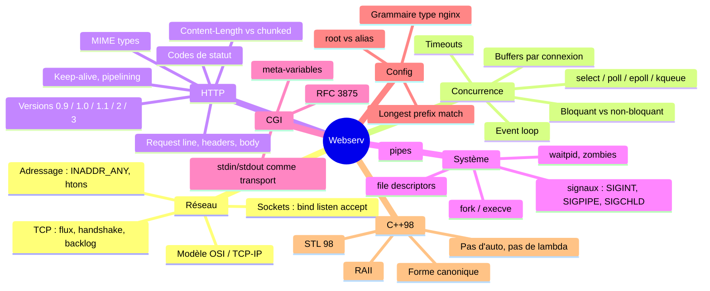

# Webserv — le cours

## Comment lire ce dossier

| Fichier | Ce que tu y trouves | Quand le lire |
|---|---|---|
| **00-INDEX.md** | Ce fichier. Le fil rouge, la vue d'ensemble. | Maintenant, en entier. |
| **01-reseau-tcp-sockets.md** | OSI, TCP/IP, ports, l'API socket de A à Z | Avant d'écrire `ListenSocket` |
| **02-multiplexing-non-bloquant.md** | Bloquant vs non-bloquant, select/poll/epoll/kqueue, event loop | Le cœur du projet. Deux fois. |
| **03-http-le-protocole.md** | Anatomie HTTP, versions, méthodes, codes, headers, chunked | Avant le parser |
| **04-parsing-http.md** | State machine, buffers, tous les pièges | Avec le 03 |
| **05-config-et-routing.md** | Grammaire nginx, résolution URI → fichier | Module A |
| **06-cgi.md** | RFC 3875, meta-variables, le pipeline complet | Module D |
| **07-processus-fd-signaux.md** | fork, execve, pipes, waitpid, zombies, SIGPIPE, fds | Avec le 06 |
| **08-cpp98-et-architecture.md** | Contraintes C++98, RAII, découpage en classes | Avant de coder |
| **09-tests-et-debug.md** | telnet, curl, nginx, valgrind, siege, tests Python | En continu |
| **10-securite.md** | Path traversal, DoS, slowloris, header injection | Ton dada, et ça rapporte à la soutenance |
| **11-soutenance-questions.md** | 60 questions d'évaluation avec les réponses | 3 jours avant |

---

## 1. De quoi on parle, vraiment

Un serveur HTTP, dépouillé, c'est **une boucle qui traduit des octets en octets**.

```
octets sur une socket  →  requête structurée  →  décision  →  réponse structurée  →  octets sur la socket
```

Tout le reste, c'est de l'ingénierie autour de ce fait. Les trois difficultés réelles du projet :

1. **Les octets n'arrivent pas quand tu veux, ni en une fois.** TCP est un flux, pas une suite de messages. Le navigateur peut t'envoyer `GET / HT` puis, 40 ms plus tard, `TP/1.1\r\n\r\n`. Ton code doit survivre à une coupure à n'importe quel octet.
2. **Tu n'as pas le droit d'attendre.** Un seul thread, un seul `poll()`. Si tu bloques 200 ms sur un client lent, les 300 autres attendent. Toute ton architecture découle de cette contrainte.
3. **Tu n'as pas le droit de mourir.** Un crash = 0. Pas « note diminuée » : **zéro**.

Ces trois contraintes s'appellent, ensemble, une **event loop**. C'est ce que fait nginx. C'est ce que fait Node.js. C'est ce que fait Redis. Ce projet, c'est ça que tu apprends — HTTP est juste le prétexte.

---

## 2. La carte mentale



---

## 3. Le fil rouge : une requête, du câble à l'écran

Suis ce chemin. Chaque étape renvoie au fichier qui la détaille.

**① Le navigateur ouvre une connexion TCP** vers `127.0.0.1:8080`. Trois paquets (SYN, SYN-ACK, ACK), gérés par le noyau. Toi, tu as juste appelé `listen()` avant. → *01*

**② Ton `poll()` te réveille** : `POLLIN` sur ton listen_fd. Ça veut dire « il y a une connexion en attente dans la file d'accept ». Tu appelles `accept()`, tu récupères un nouveau fd. → *02*

**③ Tu passes ce fd en non-bloquant** et tu l'ajoutes à ton tableau de poll. Il est maintenant un citoyen comme les autres. → *02*

**④ Le navigateur envoie des octets.** `poll()` te réveille avec `POLLIN` sur ce fd. Tu fais **un seul** `recv()` de 4 ou 8 Ko dans le buffer de cette connexion. Peut-être que tu reçois toute la requête. Peut-être 12 octets. Tu ne sais pas et tu ne dois pas faire d'hypothèse. → *02*

**⑤ Tu donnes ces octets au parser.** Il avance dans sa state machine et te répond `INCOMPLETE`, `COMPLETE` ou `ERROR`. S'il dit `INCOMPLETE`, tu ne fais rien de plus : tu retournes dans le poll et tu attends la suite. → *04*

**⑥ Requête complète.** Tu as une méthode, une URI, des headers, peut-être un body. Tu demandes à la config : « pour ce `host:port` et cette URI, quelle `location` s'applique ? » → *05*

**⑦ La location décide.** Méthode autorisée ? Sinon 405. Redirection ? Alors 301 et c'est fini. Body trop gros ? 413. Sinon, on transforme l'URI en chemin disque via le `root`. → *05*

**⑧ Le chemin pointe sur quoi ?**
- Un fichier `.html` → tu le lis, tu devines le MIME type, tu construis la réponse. → *03*
- Un dossier → `index` s'il existe, sinon autoindex si activé, sinon 403. → *05*
- Un fichier `.py` avec `cgi_ext .py` → tu forkes. → *06*, *07*
- Rien → 404 avec ta page d'erreur. → *03*

**⑨ Le CGI, s'il y en a un.** `pipe()` × 2, `fork()`, l'enfant fait `dup2` + `chdir` + `execve`. Le parent enregistre les deux pipes dans **le même poll()**. Le body part dans stdin du script, la sortie revient par stdout. `waitpid(WNOHANG)` pour ne pas bloquer, timeout pour tuer un script qui part en boucle. → *06*, *07*

**⑩ Tu sérialises la réponse** dans le buffer de sortie : `HTTP/1.1 200 OK\r\n`, les headers, `\r\n\r\n`, le body. Tu armes `POLLOUT`.

**⑪ `poll()` te dit que tu peux écrire.** Tu fais **un seul** `send()`. Il te renvoie 3000 alors que tu voulais en envoyer 50000 ? Normal, le buffer noyau est plein. Tu gardes les 47000 restants, tu retournes dans le poll. → *02*

**⑫ Buffer vide.** Tu désarmes `POLLOUT` (sinon 100% CPU). Si `Connection: keep-alive`, tu remets le parser à zéro et tu attends la prochaine requête. Sinon tu fermes.

Voilà. **Tout le projet est là.** Les 5000 lignes que tu vas écrire ne font qu'implémenter ces douze points sans jamais bloquer et sans jamais crasher.

---

## 4. Les cinq erreurs qui coûtent le projet

**① Lire ou écrire sans passer par poll.**
Le sujet est explicite : « Calling read/recv or write/send on these descriptors without prior readiness will result in a grade of 0. » Y compris les pipes du CGI. Y compris à l'initialisation. La seule exception : les fichiers disque réguliers.

**② Lire `errno` après un read/write.**
Interdit tout aussi explicitement. Ça vise le pattern classique `if (recv(...) == -1 && errno == EAGAIN)`. Tu ne dois pas en avoir besoin : si poll dit prêt, tu lis une fois, et tu traites le retour (`> 0`, `== 0`, `< 0`) sans consulter errno. `< 0` → tu fermes la connexion, point.

**③ Boucler sur `recv` jusqu'à `EAGAIN`.**
Tentant, et c'est un piège double : ça t'oblige à lire errno (interdit), et ça permet à un client hostile de te tenir dans la boucle indéfiniment. **Un événement poll = une syscall.** Retourne dans le poll.

**④ POLLOUT armé en permanence.**
Une socket est presque toujours prête en écriture. Si tu la surveilles toujours, `poll()` retourne instantanément à chaque tour et ton process bouffe un cœur entier. L'évaluateur lance `top`, il voit 100%, il pose des questions. Arme POLLOUT uniquement si `!outBuf.empty()`.

**⑤ Supposer que la requête arrive en un morceau.**
`recv()` te donne 5 octets. Ton parser fait `find("\r\n\r\n")`, ne trouve rien, et... tu jettes ? Tu attends dans une boucle ? Non : tu **accumules** dans le buffer de la connexion et tu retournes dans le poll. Un parser incrémental à état n'est pas une élégance, c'est une obligation.

---

## 5. Ordre d'apprentissage conseillé

Ne lis pas les 12 fichiers d'affilée, tu vas saturer. Alterne lecture et code :

| Jour | Lecture | Code |
|---|---|---|
| 1 | 01 + 02 | Un echo server TCP mono-client bloquant, en 80 lignes. Jetable. |
| 2 | 02 (relire) | Le même en non-bloquant avec poll et 3 clients simultanés. Jetable aussi. |
| 3 | 03 + 04 | Un parser qui mange `GET / HTTP/1.1\r\nHost: x\r\n\r\n` octet par octet. |
| 4 | 08 | Le vrai squelette du projet, les interfaces figées. |
| 5+ | 05, 06, 07 selon ton module | Le vrai code. |
| Continu | 09 | Les tests, dès la première ligne. |
| Fin | 10 + 11 | Le durcissement et la soutenance. |

Les deux serveurs jetables des jours 1-2 ne sont pas une perte de temps. Ils font tomber les 80% de malentendus sur les sockets **avant** que tu aies une architecture à défendre. Tout le monde qui saute cette étape la refait plus tard, en pire, avec 3000 lignes autour.

---

## 6. Les vraies sources

**RFCs** — pas à lire en entier, à consulter :
- **RFC 1945** — HTTP/1.0. 60 pages, lisible d'un trait. C'est ta référence, le sujet le dit.
- **RFC 9112** — HTTP/1.1 message syntax (remplace la 7230). Va-y pour le chunked et le parsing exact.
- **RFC 9110** — sémantique HTTP (méthodes, codes, headers). La partie « quel code renvoyer quand ».
- **RFC 3875** — CGI. 40 pages, et tu en as besoin de 15. Section 4.1 : les meta-variables.

**Livres / références**
- Beej's Guide to Network Programming — gratuit, c'est LA référence sockets. Chapitres 5-7.
- `man 2 poll`, `man 2 accept`, `man 7 socket`, `man 2 fork`, `man 7 pipe`. Sérieusement, lis-les.
- Le code source de nginx est illisible pour commencer. Celui de `micro-httpd` ou `thttpd` beaucoup moins.

**Outils**
- `mermaid.live` pour tes diagrammes.
- `httpbin.org` pour voir des réponses HTTP bien formées.
- nginx en local : `docker run -p 8081:80 nginx` et tu compares.
