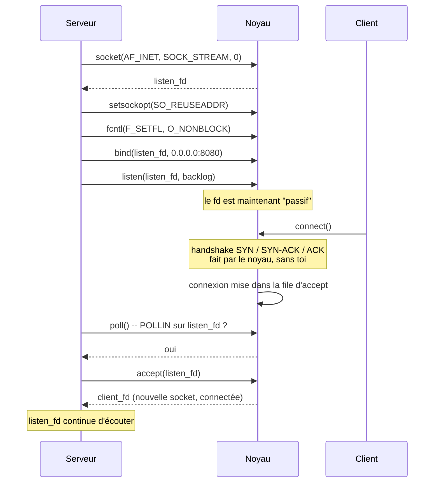
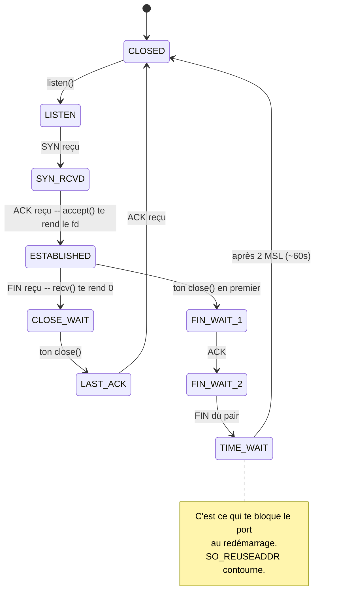

# 01 — Réseau, TCP et l'API socket

## 1. Situer HTTP dans la pile

Le modèle OSI a 7 couches, mais dans la vraie vie on utilise le modèle TCP/IP qui en a 4. Ce qui t'intéresse :

| Couche | Qui fait quoi | Ton rôle |
|---|---|---|
| **Application** — HTTP | Le sens des octets : « GET », « 404 » | **Tout. C'est ton projet.** |
| **Transport** — TCP | Flux fiable, ordonné, entre deux ports | Le noyau. Tu appelles juste l'API. |
| **Internet** — IP | Acheminer un paquet entre deux machines | Le noyau. Tu ne le vois jamais. |
| **Accès réseau** — Ethernet/Wi-Fi | Le câble | Zéro. |

**La conséquence pratique** : le noyau te garantit que les octets arrivent, dans l'ordre, sans doublon, sans corruption. Il ne te garantit **rien** sur le découpage. C'est le point le plus important de tout ce fichier.

## 2. TCP est un flux, pas un message

C'est la source de la moitié des bugs de ce projet, donc lis ça deux fois.

Le navigateur fait un `write()` de 200 octets. Toi tu fais un `recv()`. Tu peux recevoir :
- les 200 octets ;
- 12 octets, puis 188 plus tard ;
- 1 octet, 199 fois ;
- 200 octets **plus** les 150 premiers de la requête suivante (pipelining).

TCP n'a **aucune** notion de frontière de message. C'est un tuyau d'octets. Si tu veux des messages, tu les délimites toi-même — et c'est exactement ce que fait HTTP :
- la request line et les headers finissent par `\r\n\r\n` ;
- le body est délimité par `Content-Length` ou par l'encodage `chunked`.

HTTP est un protocole de **framing** posé sur TCP. Une fois que tu vois ça, le parser devient évident.

> **Les causes du découpage**, si tu veux comprendre : la MTU (~1500 octets sur Ethernet), l'algorithme de Nagle qui regroupe les petits envois, le contrôle de congestion, le buffer noyau qui se remplit, un proxy sur le trajet. Tu ne contrôles rien de tout ça. Assume le pire découpage possible.

## 3. Adresses, ports, endianness

**Un port** : 16 bits, de 1 à 65535. En dessous de 1024, il faut être root — d'où les 8080, 8081 en dev.

**Un socket TCP est identifié par un quadruplet** : `(IP source, port source, IP dest, port dest)`. C'est ça qui permet à 500 clients d'être connectés à ton port 8080 en même temps : le port dest est identique, mais l'IP:port source diffère.

**L'endianness.** Le réseau parle big-endian. Ton x86 est little-endian. D'où :

```cpp
addr.sin_port = htons(8080);           // host to network short
addr.sin_addr.s_addr = htonl(INADDR_ANY);  // host to network long
```

Oublier `htons` et ton port 8080 devient 36895. Le bug classique de la première heure.

**`INADDR_ANY` (0.0.0.0)** signifie « toutes les interfaces ». `127.0.0.1` signifie « loopback uniquement, personne de l'extérieur ne peut se connecter ». Ta config doit gérer les deux, puisqu'elle définit des paires `interface:port`.

## 4. L'API socket, appel par appel



### `socket()`

```cpp
int fd = socket(AF_INET, SOCK_STREAM, 0);
```
- `AF_INET` : IPv4. (`AF_INET6` pour IPv6, hors scope ici.)
- `SOCK_STREAM` : TCP. (`SOCK_DGRAM` = UDP.)
- `0` : protocole par défaut pour cette combinaison.

Retourne un fd, ou -1. À ce stade la socket ne fait rien : ni adresse, ni rôle.

### `setsockopt(SO_REUSEADDR)`

```cpp
int opt = 1;
setsockopt(fd, SOL_SOCKET, SO_REUSEADDR, &opt, sizeof(opt));
```

**Pourquoi c'est obligatoire ici.** Quand tu fermes une socket TCP, elle reste en état `TIME_WAIT` pendant ~60 secondes (2×MSL). Le noyau garde le port bloqué pour être sûr qu'aucun paquet retardataire de l'ancienne connexion ne pollue la nouvelle. Sans `SO_REUSEADDR`, tu tues ton serveur, tu le relances, et tu manges `bind: Address already in use` pendant une minute. En dev tu relances 300 fois par jour. Mets-le.

Ce n'est **pas** `SO_REUSEPORT`, qui est autre chose (plusieurs process sur le même port, load balancing noyau) et n'est pas dans les fonctions autorisées de toute façon.

### `bind()`

```cpp
struct sockaddr_in addr;
std::memset(&addr, 0, sizeof(addr));
addr.sin_family = AF_INET;
addr.sin_port = htons(port);
addr.sin_addr.s_addr = htonl(INADDR_ANY);
bind(fd, (struct sockaddr*)&addr, sizeof(addr));
```

Le cast vers `struct sockaddr*` est moche mais c'est l'API. `memset` d'abord : `sin_zero` doit être à zéro.

Échecs classiques : port déjà pris (`EADDRINUSE`), port < 1024 sans être root (`EACCES`).

**Le cas piège de ta config** : deux blocs `server` avec `listen 8080` et `listen 8080`. Tu ne dois créer **qu'une seule** socket. Deux `bind()` sur le même port = échec du second. Donc dédoublonne les paires interface:port avant de créer les sockets. Et `0.0.0.0:8080` + `127.0.0.1:8080` en même temps : le second bind échoue aussi sur Linux, parce que 0.0.0.0 couvre déjà 127.0.0.1.

### `listen()`

```cpp
listen(fd, SOMAXCONN);
```

Fait passer la socket en mode passif et crée la **file d'attente d'accept**. Le second argument (backlog) est la taille de cette file : le nombre de connexions dont le handshake est terminé mais que tu n'as pas encore `accept()`ées.

Si la file est pleine, le noyau refuse ou ignore les nouveaux SYN. Sous stress test, un backlog de 5 te fait perdre des connexions. `SOMAXCONN` (4096 sur Linux récent) ou 128, pas 5.

### `accept()`

```cpp
int client_fd = accept(listen_fd, NULL, NULL);
```

Retire une connexion de la file et te rend **une nouvelle socket**, déjà connectée. `listen_fd` continue son travail — ne le ferme jamais.

Points d'attention :
- Sur Linux, le fd retourné par `accept()` **n'hérite pas** de `O_NONBLOCK`. Tu dois le refaire à la main sur chaque nouveau fd. Oubli classique → un `recv` bloquant → tout le serveur se fige sur un client lent.
- Si tu passes les arguments 2 et 3, tu récupères l'adresse du client. Utile pour les logs et pour `REMOTE_ADDR` dans le CGI.
- `accept()` sur une socket non-bloquante sans connexion en attente retourne -1. Mais comme tu ne l'appelles que sur `POLLIN`, le cas ne devrait pas se présenter.

### `recv()` / `send()`

```cpp
ssize_t n = recv(fd, buf, sizeof(buf), 0);
ssize_t n = send(fd, data, len, 0);
```

Identiques à `read`/`write` avec un argument de flags en plus (0 = comportement standard). Les trois retours de `recv` :

| Retour | Signification | Ce que tu fais |
|---|---|---|
| `> 0` | n octets lus | Tu les ajoutes au buffer d'entrée |
| `== 0` | **Le pair a fermé proprement** (FIN reçu) | Tu fermes ta connexion |
| `< 0` | Erreur | Tu fermes la connexion. **Sans lire errno.** |

Le `== 0` est le plus mal compris. Ce n'est pas « rien à lire », c'est **fin de flux**. Sur une socket non-bloquante avec POLLIN levé, `recv` ne retourne jamais 0 « juste comme ça ».

Pour `send`, le retour est le nombre d'octets **réellement** écrits, souvent inférieur à ce que tu demandes quand le buffer noyau se remplit. D'où :

```cpp
ssize_t n = send(fd, outBuf.data(), outBuf.size(), 0);
if (n > 0)
    outBuf.erase(0, n);   // seulement ce qui est parti
```

Croire que `send` écrit tout, c'est le bug qui tronque tes gros fichiers. Et il ne se voit qu'à partir de ~64 Ko, donc jamais sur ton `index.html` de test.

### `close()`

Libère le fd. Si des octets restaient dans le buffer d'envoi, le noyau essaie de les envoyer (comportement par défaut, `SO_LINGER` peut changer ça).

Chaque fd non fermé est une fuite. À 1024 fds (limite molle par défaut), `accept()` échoue et ton serveur ne prend plus personne. Sous stress test ça se voit en 30 secondes.

## 5. Le cycle de vie TCP en vrai



`ss -tan | grep 8080` te montre ces états en direct. Utile quand tu débugues des fds qui traînent.

## 6. Le RST et SIGPIPE

Deux façons pour une connexion de mourir :

**FIN** — fermeture propre. Ton `recv` retourne 0. Tu fermes. Fin de l'histoire.

**RST** — fermeture brutale. Le client a fait Ctrl-C, ou tu écris sur une socket que le pair a déjà fermée. Conséquence : ton `send()` déclenche **SIGPIPE**, dont l'action par défaut est de **tuer ton process**.

Un `Ctrl-C` sur un `curl` pendant un gros téléchargement, et ton serveur meurt. Note : 0.

Deux parades :

```cpp
signal(SIGPIPE, SIG_IGN);   // simple, global, autorisé par le sujet
```
ou `send(fd, buf, len, MSG_NOSIGNAL)` sur Linux (mais `MSG_NOSIGNAL` n'existe pas sur macOS, où il faut `setsockopt(SO_NOSIGPIPE)`). Le `SIG_IGN` est portable et suffit. Avec SIGPIPE ignoré, `send` retourne juste -1, et toi tu fermes la connexion.

**Fais ça au jour 1.** C'est trois lignes et ça élimine une classe entière de morts.

## 7. À retenir

- TCP est un flux. Aucun découpage garanti. Ton parser doit être incrémental.
- `htons` sur le port, toujours.
- `SO_REUSEADDR` avant `bind`, toujours.
- `O_NONBLOCK` sur chaque fd, y compris ceux que te rend `accept()`.
- `recv() == 0` veut dire « le pair a fermé », pas « rien à lire ».
- `send()` écrit partiellement. Gère le reste.
- `signal(SIGPIPE, SIG_IGN)` au démarrage.
- Un fd non fermé est une fuite qui tue ton serveur au stress test.

## 8. Exercice

Écris un echo server TCP en 80 lignes, mono-client, bloquant. Teste-le avec `telnet localhost 8080`. Puis tue le serveur, relance-le immédiatement : observe `Address already in use`. Ajoute `SO_REUSEADDR`, recommence. Maintenant tu **sais** à quoi il sert, tu ne le copies plus.

Ensuite : `printf "hello" | nc localhost 8080` et fais afficher combien d'octets chaque `recv` te rend. Puis envoie 1 Mo. Compare.
