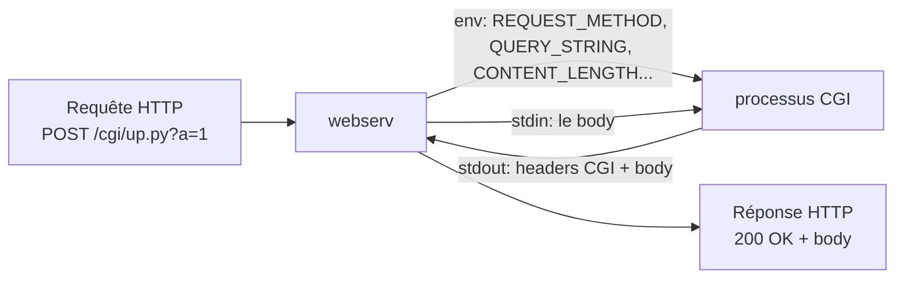
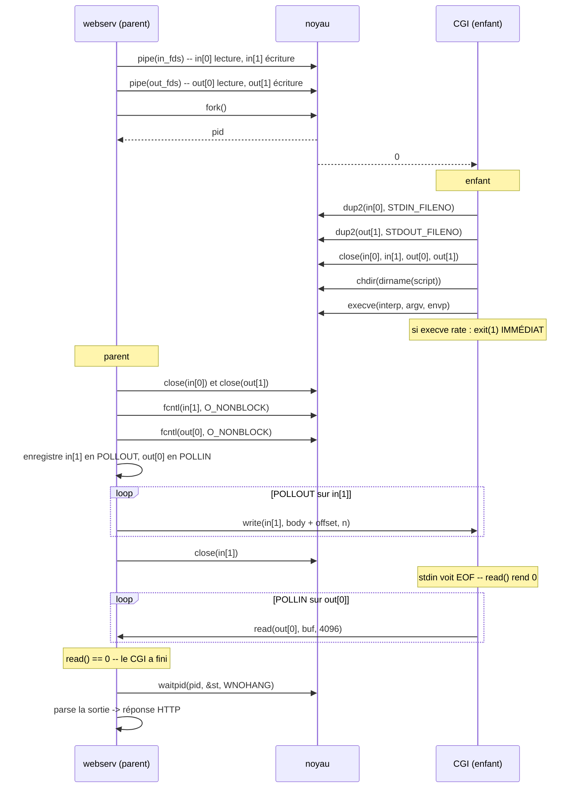

# 06 — CGI

## 1. Le concept

**CGI = Common Gateway Interface**, RFC 3875, 1997. La toute première façon de faire du web dynamique.

L'idée est d'une simplicité désarmante :
> Le serveur web ne sait pas exécuter du PHP. Alors il lance `php-cgi` comme un programme normal, lui passe la requête **par les variables d'environnement et stdin**, et récupère la réponse **sur stdout**.

C'est tout. Pas de protocole binaire, pas de socket. `fork`, `execve`, deux pipes, des `char**`.



Aujourd'hui c'est obsolète (un fork par requête, ça ne passe pas à l'échelle) — remplacé par FastCGI, WSGI, ASGI. Mais **le modèle mental est resté identique** : un serveur qui parle HTTP, un runtime applicatif à côté, un protocole entre les deux. Comprendre CGI, c'est comprendre pourquoi `php-fpm` et `gunicorn` existent.

## 2. Un CGI, concrètement

```python
#!/usr/bin/env python3
import os, sys

body = ""
length = os.environ.get("CONTENT_LENGTH", "")
if length.isdigit() and int(length) > 0:
    body = sys.stdin.read(int(length))

print("Content-Type: text/html")
print()                                    # LA LIGNE VIDE
print("<h1>Hello</h1>")
print(f"<p>Méthode : {os.environ.get('REQUEST_METHOD')}</p>")
print(f"<p>Query : {os.environ.get('QUERY_STRING')}</p>")
print(f"<p>Body : {body}</p>")
```

La sortie brute :
```
Content-Type: text/html\n
\n
<h1>Hello</h1>...
```

Le script produit des **headers CGI** puis un body, séparés par une ligne vide. Il ne produit **pas** de ligne de statut `HTTP/1.1 200 OK` — c'est ton boulot.

## 3. Les meta-variables (RFC 3875 §4.1)

C'est la partie que le correcteur vérifie avec un script qui dump `os.environ`.

| Variable | Valeur | Exemple |
|---|---|---|
| `REQUEST_METHOD` | La méthode | `POST` |
| `SCRIPT_NAME` | Le chemin virtuel du script | `/cgi-bin/up.py` |
| `SCRIPT_FILENAME` | Le chemin disque (non standard, mais **php-cgi l'exige**) | `/var/www/cgi-bin/up.py` |
| `PATH_INFO` | Ce qui suit le script dans l'URI | `/extra/path` |
| `PATH_TRANSLATED` | `PATH_INFO` mappé sur le disque | `/var/www/extra/path` |
| `QUERY_STRING` | Après le `?`, **non décodé** | `a=1&b=2` |
| `CONTENT_LENGTH` | Taille du body. **Vide si pas de body.** | `42` |
| `CONTENT_TYPE` | Type du body | `application/x-www-form-urlencoded` |
| `SERVER_PROTOCOL` | | `HTTP/1.1` |
| `SERVER_SOFTWARE` | | `webserv/1.0` |
| `SERVER_NAME` | Le host | `localhost` |
| `SERVER_PORT` | | `8080` |
| `GATEWAY_INTERFACE` | Toujours ça | `CGI/1.1` |
| `REMOTE_ADDR` | IP du client | `127.0.0.1` |
| `REDIRECT_STATUS` | **php-cgi refuse de tourner sans** | `200` |
| `HTTP_*` | Tous les headers de la requête | voir plus bas |

### La règle `HTTP_*`

Chaque header HTTP devient une variable : majuscules, tirets → underscores, préfixe `HTTP_`.

```
User-Agent: curl/8.4     ->  HTTP_USER_AGENT=curl/8.4
Accept-Language: fr      ->  HTTP_ACCEPT_LANGUAGE=fr
Cookie: session=abc      ->  HTTP_COOKIE=session=abc
```

**Exceptions** : `Content-Length` et `Content-Type` n'ont **pas** le préfixe `HTTP_` — ce sont `CONTENT_LENGTH` et `CONTENT_TYPE`. Piège classique.

> **Note sécu** : cette règle est l'origine de **Shellshock** (CVE-2014-6271). Un header `User-Agent: () { :;}; /bin/rm -rf /` devenait `HTTP_USER_AGENT` dans l'env, et bash interprétait la définition de fonction à son démarrage. Des millions de serveurs CGI compromis. Ça illustre le vrai risque : **tout ce qui vient du client se retrouve dans l'env du CGI**. Ne mets jamais rien du client dans le *nom* d'une variable, seulement dans sa valeur. Voir *10-securite.md*.

### `PATH_INFO`, le concept mal compris

URI : `/cgi-bin/script.py/users/42?sort=asc`

| | |
|---|---|
| `SCRIPT_NAME` | `/cgi-bin/script.py` |
| `PATH_INFO` | `/users/42` |
| `QUERY_STRING` | `sort=asc` |

Le script est `script.py`, et `/users/42` est un argument passé dans le chemin. C'est l'ancêtre du routing REST. Pour le trouver, tu avances segment par segment dans le chemin jusqu'à tomber sur un fichier qui matche une extension CGI ; ce qui reste est `PATH_INFO`.

Beaucoup de groupes ne gèrent pas `PATH_INFO` (chaîne vide) et passent quand même. Mais si tu le fais et que tu peux l'expliquer, tu marques un point.

### Construire l'envp

`execve` veut un `char* envp[]` terminé par NULL. En C++98 :

```cpp
std::vector<std::string> envStrings;
envStrings.push_back("REQUEST_METHOD=" + req.method);
envStrings.push_back("QUERY_STRING=" + req.query);
// ...

std::vector<char*> envp;
for (size_t i = 0; i < envStrings.size(); ++i)
    envp.push_back(const_cast<char*>(envStrings[i].c_str()));
envp.push_back(NULL);

execve(interpreter.c_str(), &argv[0], &envp[0]);
```

**Attention à la durée de vie** : `envStrings` doit rester vivant jusqu'à l'`execve`. Si tu construis le vecteur de `char*` à partir de temporaires, tu pointes sur de la mémoire libérée. Bug qui marche 9 fois sur 10 et casse la dixième.

## 4. Le pipeline complet



Le code, côté parent :

```cpp
bool CgiProcess::start(const Request& req, const LocationConfig& loc,
                       const std::string& scriptPath)
{
    if (pipe(_in) < 0) return false;
    if (pipe(_out) < 0) { close(_in[0]); close(_in[1]); return false; }

    _pid = fork();
    if (_pid < 0) { /* close les 4 */ return false; }

    if (_pid == 0) {
        // ENFANT
        dup2(_in[0],  STDIN_FILENO);
        dup2(_out[1], STDOUT_FILENO);
        close(_in[0]); close(_in[1]);
        close(_out[0]); close(_out[1]);

        chdir(dirOf(scriptPath).c_str());

        char* argv[3];
        argv[0] = const_cast<char*>(interp.c_str());
        argv[1] = const_cast<char*>(baseOf(scriptPath).c_str());
        argv[2] = NULL;

        execve(interp.c_str(), argv, envp);
        std::exit(1);           // execve a raté -> on sort, on ne revient PAS
    }

    // PARENT
    close(_in[0]);              // on n'écrit pas dans la lecture
    close(_out[1]);             // on ne lit pas dans l'écriture
    fcntl(_in[1],  F_SETFL, O_NONBLOCK);
    fcntl(_out[0], F_SETFL, O_NONBLOCK);
    _startTime = time(NULL);
    return true;
}
```

## 5. Les six pièges

### ① Ne pas fermer les bons pipes

Chaque pipe a deux bouts. Après le fork, **quatre** fds existent en double. Si le parent garde `_out[1]` ouvert, alors quand le CGI ferme son stdout, le pipe n'est **pas** fermé (il reste un écrivain : toi). `read(_out[0])` ne rend jamais 0. Ton serveur attend l'EOF pour toujours.

C'est le bug CGI numéro un. Ferme les deux bouts inutiles des deux côtés, immédiatement.

### ② `exit()` après un `execve` raté

`execve` ne revient **que** s'il échoue. Si tu ne fais pas `exit(1)` juste après, l'enfant continue à exécuter... le code de ton serveur. Tu as deux webserv, deux boucles poll, deux processus qui se battent sur les mêmes fds. Comportement chaotique, débogage impossible.

`std::exit(1)` — pas `return`, pas de destructeurs (`_exit()` est même préférable, mais `exit` passe).

### ③ Tout bloquer

Le piège fondamental :
```cpp
// NON
write(_in[1], body.c_str(), body.size());     // pipe plein à 64 Ko -> bloque
while ((n = read(_out[0], buf, 4096)) > 0)    // bloque tant que le CGI calcule
    output.append(buf, n);
waitpid(_pid, &st, 0);                        // bloque jusqu'à la mort du CGI
```
Un script à `time.sleep(3)` fige tes 500 clients trois secondes. Un `while True: pass` les fige à vie. Pipes en `O_NONBLOCK`, dans ton poll, `waitpid` en `WNOHANG`. Pas de négociation.

### ④ Pas de `chdir`

Le sujet : « The CGI should be run in the correct directory for relative path file access. » Un script qui fait `open("data.txt")` cherche dans le **cwd du process**, qui est celui de webserv — pas celui du script.

`chdir(dirname(script))` dans l'enfant, avant `execve`. Dans l'enfant uniquement : un `chdir` dans le parent change le cwd de tout ton serveur et casse tous tes chemins relatifs de config.

Comme le cwd est celui du script, `argv[1]` peut être juste le **basename**.

### ⑤ Les zombies

Un enfant terminé dont personne n'a lu le statut reste en zombie. Il ne consomme pas de RAM, mais il occupe une entrée dans la table des processus. 1000 requêtes CGI = 1000 zombies = `fork()` échoue. `ps aux | grep defunct` le montre.

`waitpid(_pid, &st, WNOHANG)` à chaque tour de boucle après l'EOF. `WNOHANG` = « si l'enfant n'est pas fini, rends 0 tout de suite ». Voir *07-processus-fd-signaux.md*.

### ⑥ Pas de timeout

```python
while True:
    pass
```
Sans timeout, ce script tourne pour l'éternité, ta connexion ne se ferme jamais, ton fd fuit, et à 1024 fds ton serveur est mort. Le correcteur **a** ce script sur sa clé USB.

```cpp
if (time(NULL) - _startTime > CGI_TIMEOUT) {   // 5-10 s
    kill(_pid, SIGKILL);
    waitpid(_pid, &st, 0);                     // ici c'est ok, il vient de mourir
    return respond(504);
}
```

`SIGKILL`, pas `SIGTERM` : un script peut ignorer SIGTERM. SIGKILL n'est pas interceptable.

## 6. Parser la sortie du CGI

```
Content-Type: text/html\n
Status: 404 Not Found\n
Set-Cookie: session=abc\n
\n
<html>...
```

Trois headers CGI spéciaux :

| Header | Effet |
|---|---|
| `Status: 404 Not Found` | Devient ta ligne de statut. **Ne le recopie pas dans les headers HTTP.** |
| `Location: /autre` | Redirection. Statut 302 si pas de `Status:` explicite. |
| `Content-Type` | Recopié tel quel |

Le reste des headers est recopié dans ta réponse.

```cpp
Response CgiProcess::buildResponse()
{
    size_t sep = _output.find("\r\n\r\n");
    size_t seplen = 4;
    if (sep == std::string::npos) {
        sep = _output.find("\n\n");             // les scripts Python font \n
        seplen = 2;
    }
    if (sep == std::string::npos)
        return Response(502);                    // sortie CGI invalide

    std::string head = _output.substr(0, sep);
    std::string body = _output.substr(sep + seplen);

    Response r(200);
    // parse head ligne par ligne, gère Status:, recopie le reste
    // ...
    r.setBody(body);
    r.setHeader("Content-Length", toString(body.size()));   // TOUJOURS
    return r;
}
```

**Le `\n\n` vs `\r\n\r\n`.** La RFC dit CRLF. Python `print()` produit `\n`. Si tu ne cherches que `\r\n\r\n`, aucun script Python ne marche. Cherche les deux, prends le premier trouvé.

**`Content-Length` sur la sortie CGI.** Le sujet : « If no content_length is returned from the CGI, EOF will mark the end of the returned data. » Autrement dit, tu lis jusqu'à l'EOF du pipe, tu sais donc la taille exacte, et tu **la mets** dans ta réponse HTTP. Le client, lui, a besoin d'un `Content-Length` — il ne peut pas deviner. Sinon tu dois fermer la connexion pour signaler la fin, ce qui casse le keep-alive.

**Le CGI qui ne produit rien** (exit code non nul, script planté) → `_output` vide → tu ne trouves pas de séparateur → **502 Bad Gateway**, pas un crash sur un `substr` hors bornes.

## 7. Le body vers le CGI

**Dé-chunker d'abord.** Le sujet : « for chunked requests, your server needs to un-chunk them, the CGI will expect EOF as the end of the body ». Ton parser HTTP a déjà fait ce travail : `req.body` est brut. Tu écris ça dans le pipe.

**`CONTENT_LENGTH` = la taille du body dé-chunké**, pas la taille sur le fil.

**Écrire par morceaux** :
```cpp
void CgiProcess::onPollOut()
{
    size_t remaining = _body.size() - _bodyOffset;
    if (remaining == 0) { closeStdin(); return; }

    ssize_t n = write(_in[1], _body.data() + _bodyOffset,
                      std::min(remaining, (size_t)65536));
    if (n > 0) {
        _bodyOffset += n;
        if (_bodyOffset == _body.size()) closeStdin();
    } else {
        closeStdin();   // le CGI a fermé son stdin, ou erreur -> on arrête
    }
}
```

`closeStdin()` fait `close(_in[1])` et retire le fd du poll. **C'est ce close qui provoque l'EOF côté CGI.** Sans lui, un script qui fait `sys.stdin.read()` attend pour toujours → ton timeout finit par le tuer → 504 sur une requête parfaitement valide.

Cas particulier : un CGI en GET n'a pas de body. Ferme `_in[1]` **immédiatement** après le fork. Sinon un script qui lit stdin par réflexe attend l'éternité.

Et si le CGI ferme son stdin avant d'avoir tout lu (il n'a lu que les 100 premiers octets) ? Ton `write` déclenche SIGPIPE. D'où `signal(SIGPIPE, SIG_IGN)` — encore lui.

## 8. Faire marcher php-cgi

Trois pièges spécifiques à PHP, et le sujet le cite en exemple :

**`REDIRECT_STATUS=200`** dans l'env. Sans ça, php-cgi refuse de démarrer (`Security Alert! The PHP CGI cannot be accessed directly`). C'est une protection contre l'exécution directe via `?script.php`.

**`SCRIPT_FILENAME`** — pas standard RFC 3875, mais php-cgi s'en sert pour trouver le fichier. Sans, il ne trouve rien.

**Le binaire est `php-cgi`, pas `php`.** `php` en CLI n'émet pas les headers CGI.

Le test minimal :
```bash
REDIRECT_STATUS=200 SCRIPT_FILENAME=/abs/path/test.php REQUEST_METHOD=GET php-cgi
```
Si ça sort du HTML dans ton terminal, ton env est bon. Sinon inutile de chercher dans ton C++.

Python est plus indulgent : `python3 script.py` marche avec un env minimal. **Commence par Python**, ajoute PHP après si tu vises le bonus « multiple CGI types ».

## 9. À retenir

- CGI = fork + execve + 2 pipes + des variables d'env. Rien de magique.
- Ferme les deux bouts inutiles de chaque pipe, des deux côtés. Sinon pas d'EOF.
- `exit(1)` juste après `execve` dans l'enfant. Toujours.
- Pipes non-bloquants, dans **ton** poll. `waitpid(WNOHANG)`. Timeout + SIGKILL.
- `chdir` dans l'enfant seulement.
- `CONTENT_LENGTH` et `CONTENT_TYPE` sans le préfixe `HTTP_`.
- `close(_in[1])` provoque l'EOF sur le stdin du CGI. Sans lui, deadlock.
- Cherche `\n\n` **et** `\r\n\r\n` dans la sortie.
- `Status:` devient ta ligne de statut et ne va pas dans les headers.
- Calcule et envoie toujours `Content-Length`.
- Sortie vide ou invalide → 502, pas un crash.

## 10. Exercice

Écris `hello.py` qui dump son environnement complet en HTML. Sers-le. Compare avec ce que produit nginx + `fcgiwrap` sur le même script (ou un Apache avec `mod_cgi`, plus simple à installer). Chaque variable manquante ou différente est un ticket.

Puis `slow.py` avec un `time.sleep(10)` : ton serveur doit rester réactif pendant ces 10 secondes (ouvre un autre onglet), puis répondre 504 à ton timeout. Si le deuxième onglet pend, tu bloques quelque part.
