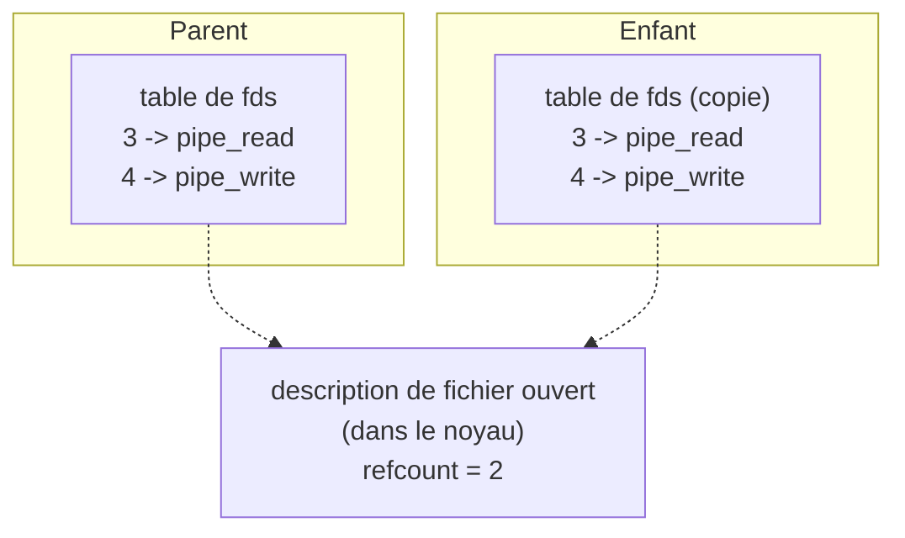

# 07 — Processus, file descriptors et signaux

Les notions UNIX sous le CGI. Si tu as fait minishell, tu connais 80% de ce fichier — mais les pièges sont différents ici, parce que **rien n'a le droit de bloquer**.

## 1. Les file descriptors

Un fd est un **entier**, un index dans la table des fichiers ouverts du process. C'est tout. Il ne « contient » rien.

```
fd 0 -> stdin
fd 1 -> stdout
fd 2 -> stderr
fd 3 -> ton listen_fd
fd 4 -> un client
...
```

Le noyau donne toujours **le plus petit fd libre**. D'où l'astuce classique :
```cpp
close(STDIN_FILENO);
int fd = open("x", O_RDONLY);   // fd == 0
```
À ne pas faire, mais à comprendre : ça explique pourquoi `dup2` existe.

### La table est partagée après un fork



`fork()` **duplique la table**, mais les entrées pointent sur les **mêmes** objets noyau. Chaque `open`/`pipe` incrémente un compteur de références. L'objet n'est détruit qu'à zéro.

**C'est la source du bug CGI numéro un.** Le pipe de sortie a deux écrivains après le fork : l'enfant et toi. Le CGI se termine, ferme son bout — refcount passe de 2 à 1, **pas à 0**. `read()` sur l'autre bout ne rend jamais 0 : il y a encore un écrivain potentiel, c'est **toi**. Ton serveur attend un EOF qui n'arrivera jamais.

Ferme `_out[1]` dans le parent immédiatement après le fork. Idem `_in[0]`.

### `FD_CLOEXEC`

Le sujet autorise ce flag. Il signifie : « ferme ce fd automatiquement à l'`execve` ».

Le problème qu'il résout : ton serveur a 200 clients connectés, fd 5 à 204. Tu forkes pour un CGI. L'enfant hérite des 200 fds. Il fait `execve` — et le script Python a maintenant accès aux sockets de tous tes clients. Un CGI compromis peut lire et écrire dans les connexions des autres.

```cpp
fcntl(client_fd, F_SETFD, FD_CLOEXEC);   // sur chaque fd non-CGI
```

Note : `F_SETFD` (flags du descripteur) pas `F_SETFL` (flags du fichier). Deux appels différents. Le sujet mentionne `FD_CLOEXEC` dans les flags autorisés, ce qui implique `F_SETFD`.

Ce n'est pas obligatoire pour la note, mais c'est le genre de détail qui marque en soutenance — surtout si tu vises la cybersécurité.

### La limite de fds

`ulimit -n` → 1024 par défaut. Chaque connexion = 1 fd. Chaque CGI = 2 de plus. À 1024, `accept()` échoue.

Deux réflexes :
- **Ne fuis pas.** Chaque `open`, `accept`, `pipe` a son `close`, sur **tous** les chemins de sortie, y compris les erreurs.
- **Gère l'échec d'accept.** Si `accept` rend -1 parce que tu es à court de fds, ne crashe pas : logge, et continue. Idéalement, garde un fd de secours à fermer pour pouvoir accepter et refuser proprement avec un 503. Sophistiqué, pas exigé.

Diagnostic pendant le stress test :
```bash
watch -n1 'ls /proc/$(pgrep webserv)/fd | wc -l'
```
Ce nombre doit se stabiliser. S'il monte en escalier et ne redescend jamais, tu as une fuite. Trouve-la avant la soutenance, parce que le correcteur lance `siege` et tu ne peux pas cacher ça.

## 2. `fork()`

```cpp
pid_t pid = fork();
if (pid < 0)       { /* échec : trop de process, EAGAIN */ }
else if (pid == 0) { /* enfant : pid == 0 */ }
else               { /* parent : pid == PID de l'enfant */ }
```

Duplique le process : mémoire (en copy-on-write), table de fds, cwd, masque de signaux. À partir de là, deux process indépendants.

**Le sujet limite fork au CGI.** « You can't use fork for anything other than CGI ». Pas de pool de workers, pas de pré-fork. Un fork par requête CGI, c'est tout.

**Copy-on-write** : le fork ne recopie pas physiquement ta mémoire. Les pages sont marquées read-only et partagées ; la copie n'a lieu qu'à la première écriture. C'est pour ça qu'un fork est rapide même avec 500 Mo alloués. Bonne question de soutenance.

**Après un fork raté** : ferme tes pipes, réponds 500, continue. Ne crashe pas.

## 3. `execve()`

```cpp
execve(const char* path, char* const argv[], char* const envp[]);
```

**Remplace l'image mémoire** du process courant. Le code, le tas, la pile : tout est écrasé par le nouveau programme. Le PID ne change pas, les fds sont conservés (sauf `FD_CLOEXEC`).

**Il ne revient jamais** — sauf en cas d'échec. D'où :
```cpp
execve(interp.c_str(), argv, envp);
std::exit(1);      // OBLIGATOIRE
```
Sans le `exit`, un `execve` raté (interpréteur absent, pas les droits d'exécution) fait continuer l'enfant dans le code du serveur. Tu te retrouves avec deux boucles poll sur les mêmes fds. Le bug le plus déroutant du projet.

`argv[0]` est par convention le nom du programme. `argv` **doit** finir par NULL. `envp` aussi.

Différence avec `execvp` : `execve` ne cherche **pas** dans le `PATH`. Tu dois donner le chemin absolu de l'interpréteur — ce qui est bien, ta config le fournit (`cgi_ext .py /usr/bin/python3`). Et `execvp` n'est pas dans les fonctions autorisées de toute façon.

Avant de forker, vérifie avec `access(script, X_OK | R_OK)` : ça te donne un 403 propre au lieu d'un fork inutile qui finit en 502.

## 4. `pipe()`

```cpp
int fds[2];
pipe(fds);
// fds[0] = LECTURE
// fds[1] = ÉCRITURE
```

Mnémotechnique : 0 comme stdin (lecture), 1 comme stdout (écriture).

Unidirectionnel. Pour une communication dans les deux sens, il en faut **deux**. D'où `_in` et `_out` dans le CGI.

**Buffer de 64 Ko** sous Linux (`/proc/sys/fs/pipe-max-size`). Écrire dedans quand il est plein :
- en bloquant → tu bloques ;
- en non-bloquant → `write` rend -1 ou un envoi partiel.

D'où le POLLOUT et l'écriture incrémentale. Un POST de 10 Mo vers un CGI qui lit lentement remplit le pipe en 64 Ko et s'arrête là.

**Les sémantiques de fermeture, à connaître :**

| Situation | Effet |
|---|---|
| Tous les écrivains ont fermé | `read()` rend **0** (EOF) |
| Tous les lecteurs ont fermé | `write()` → **SIGPIPE** (ou EPIPE si ignoré) |
| Pipe vide, écrivains encore ouverts, non-bloquant | `read()` rend -1 |
| Pipe plein, non-bloquant | `write()` rend -1 ou un envoi partiel |

Les deux premières lignes sont tout ce qu'il faut retenir. Elles expliquent le §1 (pas d'EOF si tu gardes `_out[1]`) et le §6 (SIGPIPE si le CGI ferme son stdin).

## 5. `dup2()`

```cpp
dup2(oldfd, newfd);
```

« Fais que `newfd` désigne la même chose que `oldfd` ». Si `newfd` était ouvert, il est fermé d'abord — atomiquement.

Dans l'enfant CGI :
```cpp
dup2(_in[0],  STDIN_FILENO);    // le script lit le body sur stdin
dup2(_out[1], STDOUT_FILENO);   // ce que le script print part dans le pipe
```

Ensuite ferme les quatre fds originaux : ils sont dupliqués, les originaux ne servent plus, et les laisser ouverts fausse le refcount du pipe (voir §1).

**Et stderr ?** Non redirigé, il va dans le terminal de ton serveur. C'est parfait en dev : les tracebacks Python s'affichent dans tes logs. En prod on le redirigerait vers un fichier. Ne le mets **jamais** dans `_out[1]` : les messages d'erreur du script pollueraient ta réponse HTTP.

## 6. Les signaux

| Signal | Origine | Défaut | Toi |
|---|---|---|---|
| `SIGPIPE` | write sur un pipe/socket sans lecteur | **tue le process** | `SIG_IGN`, obligatoire |
| `SIGINT` | Ctrl-C | tue | Handler pour un arrêt propre |
| `SIGTERM` | `kill` | tue | Idem |
| `SIGCHLD` | Un enfant meurt | ignoré | Laisse tranquille, fais du `waitpid(WNOHANG)` |
| `SIGKILL` | `kill -9` | tue | **Non interceptable.** C'est toi qui l'envoies au CGI. |

### SIGPIPE, encore

```cpp
signal(SIGPIPE, SIG_IGN);
```

Trois lignes au démarrage, et ça élimine une classe entière de morts subites. Sans lui : un `curl` interrompu au milieu d'un gros téléchargement tue ton serveur. Note : 0.

Avec SIGPIPE ignoré, `send`/`write` retournent -1 au lieu de tuer le process. Toi tu fermes la connexion. Comportement voulu.

### Arrêt propre

```cpp
volatile sig_atomic_t g_running = 1;

void onSigint(int) { g_running = 0; }

// main
signal(SIGINT, onSigint);
signal(SIGTERM, onSigint);

while (g_running) {
    int n = poll(...);
    if (n < 0 && !g_running) break;   // poll interrompu par le signal
    // ...
}
// fermeture de tous les fds, destruction des connexions
```

`volatile sig_atomic_t` est le **seul** type dont l'écriture est garantie atomique dans un handler. Pas `bool`, pas `int`.

**Ce que tu ne dois pas faire dans un handler** : appeler `printf`, `malloc`, `new`, ou toucher à tes `std::map`. Seules les fonctions async-signal-safe sont autorisées (`man 7 signal-safety`). Un handler qui fait `std::cout << "bye"` peut deadlocker si le signal arrive pendant un autre `cout`. Le handler pose un flag. C'est tout.

**Le signal interrompt `poll()`** : il rend -1 (avec errno EINTR, que tu n'as pas le droit de lire). D'où le test `if (n < 0 && !g_running) break;` — le flag te dit si c'est un arrêt voulu.

### `SIGCHLD`

Un enfant qui meurt envoie SIGCHLD au parent. L'action par défaut est de l'ignorer, ce qui crée un zombie.

Tentation : `signal(SIGCHLD, SIG_IGN)` fait reaper automatiquement par le noyau, plus de zombies. **Mais** tu perds le code de sortie du CGI, et ton `waitpid` échoue ensuite. Ne fais pas ça. Fais du `waitpid(WNOHANG)` dans ta boucle, tu contrôles.

## 7. `waitpid()` et les zombies

Un process qui se termine passe en état **zombie** jusqu'à ce que son parent lise son statut. Il ne consomme ni CPU ni RAM — juste une entrée dans la table des processus. À quelques milliers, `fork()` échoue.

```cpp
int status;
pid_t r = waitpid(_pid, &status, WNOHANG);

if (r == 0) {
    // pas encore terminé -> on repasse plus tard
} else if (r == _pid) {
    if (WIFEXITED(status)) {
        int code = WEXITSTATUS(status);        // exit(code)
    } else if (WIFSIGNALED(status)) {
        int sig = WTERMSIG(status);            // tué par un signal
    }
    _reaped = true;
} else {
    // -1 : déjà reapé, ou pas notre enfant
}
```

**`WNOHANG` est non négociable.** Sans lui, `waitpid` bloque jusqu'à la mort du CGI, et un script en boucle infinie fige ton serveur. Le sujet l'interdit implicitement (« Your server must remain non-blocking at all times ») et explicitement (« A request to your server should never hang indefinitely »).

**Reape tous tes enfants**, y compris ceux que tu tues au timeout. Un `kill(SIGKILL)` sans `waitpid` derrière laisse un zombie.

Vérification : lance 1000 requêtes CGI, puis
```bash
ps aux | grep defunct
```
Si tu vois des lignes, tu as une fuite de zombies.

## 8. Le tableau des blocages

Chaque ligne est un endroit où on peut se figer, avec sa parade :

| Où | Pourquoi ça bloque | Parade |
|---|---|---|
| `accept` | Pas de connexion en attente | Uniquement sur POLLIN |
| `recv` | Pas de données | Uniquement sur POLLIN + O_NONBLOCK |
| `send` | Buffer noyau plein | Uniquement sur POLLOUT + O_NONBLOCK |
| `write` (pipe CGI) | Pipe plein (64 Ko) | Uniquement sur POLLOUT + O_NONBLOCK |
| `read` (pipe CGI) | Le CGI n'a rien écrit | Uniquement sur POLLIN + O_NONBLOCK |
| `waitpid` | Le CGI tourne encore | `WNOHANG` |
| `connect` | — | Tu n'en fais pas, tu es un serveur |
| `open` sur un FIFO | Aucun écrivain | `stat` + `S_ISREG` avant d'ouvrir |
| `read` sur un fichier | Disque lent | Exempté par le sujet |

Fais cette liste toi-même, à la main, avant la soutenance. Chaque syscall bloquant de ton code doit avoir sa colonne « parade » remplie. Si une case est vide, tu as un bug qui va tomber au stress test.

## 9. À retenir

- Un fd est un entier. Les objets noyau sont partagés après un fork, avec un refcount.
- **Ferme les deux bouts inutiles de chaque pipe, des deux côtés.** Sinon pas d'EOF.
- `exit(1)` après `execve`. Toujours.
- `pipe()` : `[0]` lecture, `[1]` écriture. Buffer de 64 Ko.
- `read == 0` sur un pipe ⇔ tous les écrivains ont fermé.
- `write` sur un pipe sans lecteur ⇒ SIGPIPE ⇒ `signal(SIGPIPE, SIG_IGN)`.
- `dup2` puis ferme les originaux.
- Un handler de signal pose un flag `volatile sig_atomic_t`. Rien d'autre.
- `waitpid(WNOHANG)` partout. Reape tout, y compris les tués.
- Le nombre de fds doit se stabiliser sous charge.

## 10. Exercice

Écris un programme de 40 lignes : fork, l'enfant fait `execve("/bin/ls", ...)`, le parent lit la sortie par un pipe et l'affiche.

Puis **casse-le exprès** :
1. Ne ferme pas `out[1]` dans le parent → observe le `read` qui ne rend jamais 0. Voilà ton EOF fantôme.
2. Retire le `exit(1)` après un `execve` vers un binaire inexistant → observe le message dupliqué. Voilà ton double serveur.
3. Retire le `waitpid` → `ps aux | grep defunct`. Voilà ton zombie.

Trois bugs vus en 10 minutes plutôt qu'en 3 jours dans 4000 lignes de C++.
