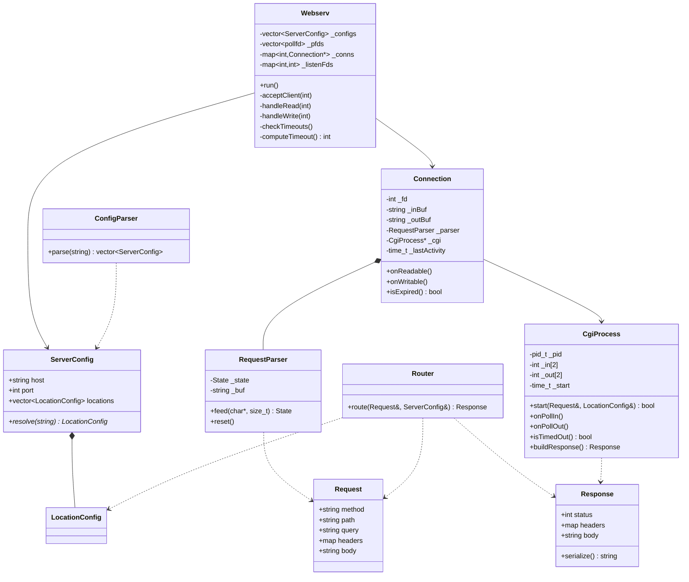

# 08 — C++98 et architecture

## 1. Ce que C++98 t'enlève

Tu viens du C et tu as fait les modules CPP. Le piège : les habitudes modernes qui compilent chez toi mais pas avec `-std=c++98`.

| Interdit (C++11+) | Le remplacement C++98 |
|---|---|
| `auto` | Le type complet. `std::map<int, Connection>::iterator` |
| `nullptr` | `NULL` ou `0` |
| Lambdas | Foncteur (struct avec `operator()`) ou fonction libre |
| `for (x : v)` | `for (size_t i = 0; i < v.size(); ++i)` ou un itérateur |
| `std::to_string` | `std::ostringstream` |
| `std::stoi` | `std::istringstream` ou `strtol` |
| `v.data()` | `&v[0]` (et gaffe si `v` est vide) |
| `emplace_back` | `push_back` |
| `unique_ptr`, `shared_ptr` | Pointeurs nus + RAII à la main |
| `override`, `final` | Rien |
| `std::unordered_map` | `std::map` |
| `= delete` | Déclarer privé, sans définir |
| `enum class` | `enum` nu |
| Initialisation `{}` | `()` ou affectation |
| `long long` | `long` (ou `unsigned long`) |
| `constexpr` | `const`, ou `enum { X = 42 }` |
| `std::array` | Tableau C ou `std::vector` |
| `noexcept` | `throw()` |

**Vérifie dès le jour 1** : `-std=c++98` dans le Makefile. Sinon tu écris 3000 lignes qui compilent avec le g++ par défaut (C++17) et tu découvres 200 erreurs à trois jours de la soutenance.

Piège vicieux : `-Werror` avec `-std=c++98` transforme `long long` en erreur (`ISO C++ 1998 does not support 'long long'`). Si tu en as besoin pour détecter un overflow, `unsigned long` suffit sur x86_64 (64 bits).

### Les remplacements que tu écriras

```cpp
// to_string
template <typename T>
std::string toString(const T& v) {
    std::ostringstream o;
    o << v;
    return o.str();
}

// stoi sécurisé
bool toInt(const std::string& s, int& out) {
    std::istringstream i(s);
    i >> out;
    return !i.fail() && i.eof();   // le eof() détecte "12abc"
}
```

Mets-les dans `Utils.hpp` au jour 1, tu vas les utiliser 200 fois.

## 2. La forme canonique de Coplien

Une classe qui gère une ressource (fd, mémoire, process) doit avoir :

```cpp
class Connection {
public:
    Connection();                              // par défaut
    Connection(const Connection& other);       // copie
    Connection& operator=(const Connection& other);  // affectation
    ~Connection();                             // destructeur
};
```

**La raison n'est pas académique.** Sans constructeur de copie, le compilateur en génère un qui copie membre à membre — donc le `int _fd` est copié tel quel. Deux objets, un seul fd. Le premier destructeur appelle `close(_fd)`. Le second appelle `close(_fd)` sur un fd déjà fermé — qui a peut-être été **réattribué** entre temps à une autre connexion par `accept()`. Tu fermes la connexion de quelqu'un d'autre.

C'est le bug le plus retors du projet : intermittent, dépendant de la charge, impossible à reproduire à la main.

Deux stratégies :

**Interdire la copie** (le plus sûr pour les classes à ressource) :
```cpp
class Connection {
private:
    Connection(const Connection&);              // déclaré, PAS défini
    Connection& operator=(const Connection&);   // idem
};
```
Toute tentative de copie → erreur à l'édition de liens. En C++11 ce serait `= delete`.

**Mais attention** : `std::map<int, Connection>` **exige** que `Connection` soit copiable (`insert` copie). Donc soit tu stockes `std::map<int, Connection*>` avec des pointeurs et un `delete` explicite, soit tu implémentes une vraie copie profonde avec transfert de propriété du fd (moche en C++98, il n'y a pas de move).

**La solution propre** : `std::map<int, Connection*>` avec `new`/`delete`, et un `Connection` non copiable. Documente le choix, il tombera en soutenance.

## 3. RAII sans smart pointers

RAII = *Resource Acquisition Is Initialization*. La ressource est prise dans le constructeur, rendue dans le destructeur. Le compilateur garantit l'appel du destructeur, y compris sur une exception.

```cpp
class FileDescriptor {
public:
    explicit FileDescriptor(int fd) : _fd(fd) {}
    ~FileDescriptor() { if (_fd >= 0) ::close(_fd); }
    int get() const { return _fd; }
    int release() { int f = _fd; _fd = -1; return f; }   // transfert
private:
    int _fd;
    FileDescriptor(const FileDescriptor&);
    FileDescriptor& operator=(const FileDescriptor&);
};
```

Utilité concrète :
```cpp
void f() {
    FileDescriptor fd(open("x", O_RDONLY));
    if (somethingWrong) return;     // le fd est fermé automatiquement
    if (otherThing) throw ...;      // fermé aussi
    // ...
}                                   // et ici
```
Sans ça, chaque `return` prématuré est une fuite. C'est exactement là que les fuites de fds naissent : dans les chemins d'erreur qu'on n'a pas testés.

Écris cette classe. 15 lignes, et elle élimine une catégorie entière de bugs.

## 4. La STL 98 en pratique

| Conteneur | Où |
|---|---|
| `std::vector<struct pollfd>` | Le tableau de poll. Contigu, `&v[0]` valide. |
| `std::map<int, Connection*>` | fd → connexion. O(log n), itérateurs stables. |
| `std::map<std::string, std::string>` | Headers. Trié, pratique. |
| `std::set<std::string>` | Méthodes autorisées. Doublons éliminés gratuitement. |
| `std::string` | Buffers. **Gère les `\0`**, contrairement à `char*`. |
| `std::deque` | Une file de requêtes si tu gères le pipelining finement |

**`std::string` pour les buffers binaires.** C'est correct : `std::string` n'a rien à voir avec les chaînes C, il stocke une taille et accepte les octets nuls. `append(data, n)`, `find(s, pos)`, `substr` marchent sur du binaire. Ce qui casse, c'est `c_str()` + `strlen`/`strstr`. N'utilise jamais les fonctions `<cstring>` sur un body uploadé.

**Le piège de l'invalidation d'itérateurs :**
```cpp
// FAUX
for (it = _conns.begin(); it != _conns.end(); ++it)
    if (expired(it)) _conns.erase(it);      // it est invalidé, ++it explose

// JUSTE (C++98)
for (it = _conns.begin(); it != _conns.end(); ) {
    if (expired(it)) _conns.erase(it++);    // post-incrément : copie, puis erase
    else             ++it;
}
```
`erase(it++)` : le post-incrément avance l'itérateur **avant** l'appel, et passe l'ancienne valeur à `erase`. Idiome C++98 classique, à connaître.

Pour un `vector`, `erase` invalide tout à partir du point d'effacement. D'où le parcours à l'envers dans la boucle poll.

**Le piège de la réallocation :**
```cpp
std::vector<struct pollfd> pfds;
struct pollfd* p = &pfds[0];
pfds.push_back(x);      // peut réallouer
p->fd = 5;              // p pointe dans le vide
```
Dans la boucle poll : ne garde jamais de pointeur ou de référence dans `_pfds` à travers un `push_back`. Utilise des indices.

## 5. Les exceptions

C++98 les a. La question : est-ce que tu les utilises ?

**Oui, dans le parsing de config** — c'est un chemin de démarrage, une exception remonte au `main`, tu affiches et tu `exit(1)`. Propre.

```cpp
class ConfigError : public std::exception {
public:
    ConfigError(const std::string& msg) : _msg(msg) {}
    virtual ~ConfigError() throw() {}
    virtual const char* what() const throw() { return _msg.c_str(); }
private:
    std::string _msg;
};
```
Le `throw()` sur le destructeur et sur `what()` est **obligatoire** : les versions de la classe de base les déclarent ainsi, et un override qui ne le fait pas est une erreur de compilation.

**Non, dans la boucle poll** — une exception qui traverse la boucle et n'est pas rattrapée fait `std::terminate` → abort → **0**.

```cpp
while (g_running) {
    try {
        poll(...);
        // ...
    } catch (const std::exception& e) {
        log("erreur : " + std::string(e.what()));
        // on ferme la connexion fautive, on continue
    } catch (...) {
        log("erreur inconnue");
    }
}
```

Ce `try/catch` autour du corps de la boucle est ton **filet de sécurité**. `std::bad_alloc` sur un serveur à court de mémoire, un `substr` hors bornes que tu n'avais pas prévu : au lieu d'un crash, tu fermes une connexion et tu continues. Le sujet est explicite : « must not crash under any circumstances (even if it runs out of memory) ». Le `bad_alloc` est nommé.

C'est trois lignes et ça peut sauver ta note.

## 6. L'architecture



### Le découpage en fichiers

```
inc/
    Webserv.hpp          ConfigParser.hpp     ServerConfig.hpp
    Connection.hpp       RequestParser.hpp    Request.hpp
    Router.hpp           Response.hpp         CgiProcess.hpp
    Utils.hpp            Exceptions.hpp
src/
    main.cpp             Webserv.cpp          ConfigParser.cpp
    ServerConfig.cpp     Connection.cpp       RequestParser.cpp
    Router.cpp           Response.cpp         Autoindex.cpp
    CgiProcess.cpp       CgiEnv.cpp           Upload.cpp
    Utils.cpp            Mime.cpp
conf/    www/    tests/    Makefile    README.md
```

**Une règle qui vaut de l'or à 3** : un fichier `.cpp` = un propriétaire. Les merges se font tout seuls. Si deux personnes doivent toucher le même fichier, c'est le signe que ton découpage est mauvais.

### Le Makefile

```makefile
NAME    := webserv
CXX     := c++
CXXFLAGS:= -Wall -Wextra -Werror -std=c++98 -Iinc
SRCDIR  := src
OBJDIR  := obj

SRCS    := $(wildcard $(SRCDIR)/*.cpp)
OBJS    := $(SRCS:$(SRCDIR)/%.cpp=$(OBJDIR)/%.o)
DEPS    := $(OBJS:.o=.d)

all: $(NAME)

$(NAME): $(OBJS)
	$(CXX) $(CXXFLAGS) $(OBJS) -o $(NAME)

$(OBJDIR)/%.o: $(SRCDIR)/%.cpp | $(OBJDIR)
	$(CXX) $(CXXFLAGS) -MMD -MP -c $< -o $@

$(OBJDIR):
	mkdir -p $(OBJDIR)

clean:
	rm -rf $(OBJDIR)

fclean: clean
	rm -f $(NAME)

re: fclean all

-include $(DEPS)

.PHONY: all clean fclean re
```

Le `-MMD -MP` génère les dépendances de headers automatiquement : tu modifies `Request.hpp`, seuls les `.cpp` qui l'incluent recompilent. C'est ce que le sujet appelle « must not perform unnecessary relinking » — et c'est aussi ce qui te fait gagner 2 minutes à chaque compilation.

## 7. Les erreurs de conception à éviter

**Un `Server` qui fait tout.** 2000 lignes dans un fichier, personne ne peut y toucher en même temps, personne ne peut le tester. Sépare : la boucle, la connexion, le parser, le routeur, le CGI.

**Des variables globales.** Sauf le `volatile sig_atomic_t g_running`, qui est obligatoire (un handler ne prend pas d'argument utilisateur). Tout le reste passe par des membres.

**Des `#include` dans les headers sans nécessité.** Forward-declare (`class Response;`) quand tu n'as qu'un pointeur ou une référence. Sinon tu recompiles tout à chaque modif.

**Pas de header guards.** `#ifndef CONNECTION_HPP` / `#define` / `#endif` sur chaque header. `#pragma once` n'est pas standard (il marche partout en pratique, mais autant être propre).

**Le CGI qui appelle directement le réseau.** Le `CgiProcess` expose ses fds et son état ; c'est la boucle qui les met dans le poll. Sinon tu ne peux pas être non-bloquant, et tu ne peux plus tester le CGI isolément.

## 8. Les compétences réelles

Ce que ce projet t'apprend, au-delà du diplôme :

**L'event loop.** Le modèle de nginx, Node, Redis, libuv, Netty. Une fois que tu as écrit la tienne, tu comprends ce que fait `async/await` sous le capot — et pourquoi une fonction bloquante dans du code async ruine les perfs. C'est la compétence la plus transférable du cursus.

**Le parsing de protocole.** Machine à états sur un flux d'octets fragmenté. Ça se retrouve partout : Redis, MQTT, WebSocket, un protocole binaire maison. Et en sécu offensive, c'est l'inverse exact : tu cherches les états mal gérés.

**La gestion des ressources.** fds, process, mémoire, sur des chemins d'erreur. C'est ce qui sépare le code qui marche 5 minutes du code qui tourne 6 mois.

**Les modèles d'attaque.** Slowloris, request smuggling, path traversal, DoS par ressource. Tu ne les défends pas en théorie : tu les vis. Vu ta spécialisation, c'est le fichier *10* qu'il faut lire deux fois.

## 9. À retenir

- `-std=c++98` dans le Makefile **dès le premier jour**.
- `toString` et `toInt` dans `Utils.hpp` au jour 1.
- Toute classe à ressource : forme canonique, ou copie interdite.
- `std::map<int, Connection*>` + `new`/`delete`, pas `map<int, Connection>`.
- `erase(it++)` pour supprimer en itérant sur une map.
- Ne garde jamais de pointeur dans un vector à travers un `push_back`.
- `std::string` gère les `\0`. `strlen`/`strstr` non.
- `try/catch` autour du corps de la boucle poll. Filet de sécurité, 3 lignes.
- Un `.cpp` = un propriétaire.
- `-MMD -MP` dans le Makefile.

## 10. Exercice

Écris les headers de `Connection`, `RequestParser`, `Response` et `CgiProcess`, corps vides. Compile-les avec `-std=c++98 -Wall -Wextra -Werror`. Ça doit passer.

C'est votre sprint 0 à trois. Une fois ces quatre fichiers gelés, chacun code dans son coin sans jamais casser les autres. Une heure de discussion ici vous économise trois jours de merges pourris.
