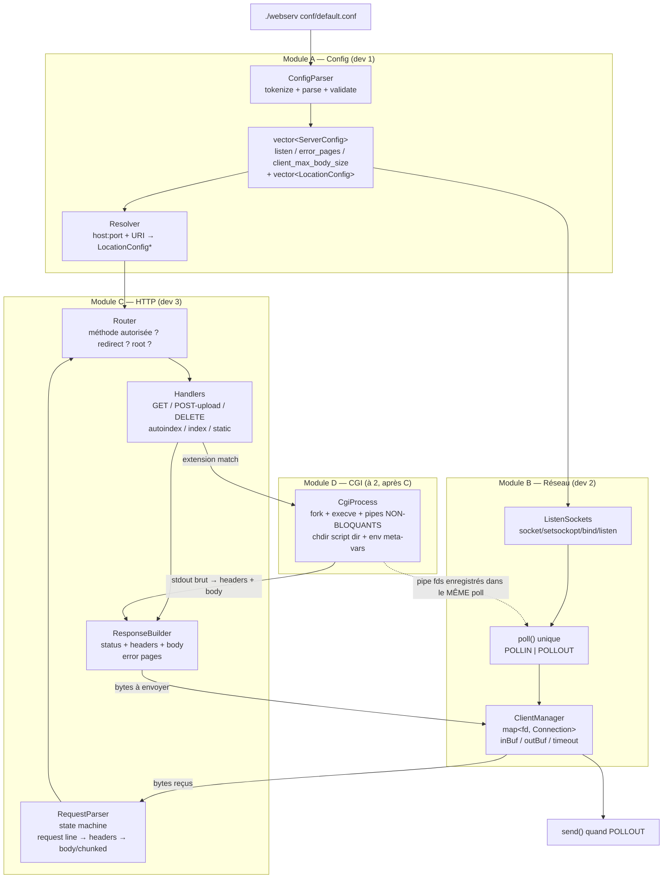

# Webserv — architecture & backlog (équipe de 3)

## 1. Architecture

**Le contrat entre modules (à figer avant d'écrire une ligne) :**

| Frontière | Signature |
|---|---|
| A → B | `ListenSockets(const std::vector<ServerConfig>& servers)` |
| A → C | `const LocationConfig* Resolve(const std::string& host, int port, const std::string& uri)` |
| B → C | `RequestParser::Feed(const char* data, size_t n)` → `enum {INCOMPLETE, COMPLETE, ERROR}` |
| C → B | `bool Response::Serialize(std::string& out)` |
| C → D | `CgiProcess::Start(req, loc)` → expose `GetReadFd()` / `GetWriteFd()` que B ajoute au poll |

## 2. Tickets

Convention : `[MOD-NN] titre — dépend de — DoD`

### Sprint 0 — ensemble (une demi-journée)

| ID | Titre | DoD |
|---|---|---|
| S0-01 | Squelette repo : Makefile (`all clean fclean re`, `-Wall -Wextra -Werror -std=c++98`), arbo `srcs/ includes/ conf/ www/ tests/` | `make` compile un `main` vide sans relink inutile |
| S0-02 | Figer les headers d'interface (`ServerConfig.hpp`, `Request.hpp`, `Response.hpp`, `Connection.hpp`) — corps vides | Les 3 modules compilent contre ces headers |
| S0-03 | Écrire `conf/default.conf` cible + `conf/bad/*.conf` (20 cas invalides) | Sert de spec au module A |
| S0-04 | Convention Git : branches `feat/a-*`, `feat/b-*`, `feat/c-*`, PR + relecture croisée obligatoire | Écrit dans le README |

### Module A — Config (dev 1)

| ID | Titre | Dépend | DoD |
|---|---|---|---|
| A-01 | Lecture fichier + tokenizer (blocs `{}`, directives `;`, commentaires `#`) | S0-03 | Dump des tokens sur un conf valide |
| A-02 | Parse bloc `server` : `listen`, `server_name`, `error_page`, `client_max_body_size` | A-01 | Struct remplie, affichable |
| A-03 | Parse bloc `location` : `allow_methods`, `root`, `index`, `autoindex`, `return`, `upload_store`, `cgi_pass`/`cgi_ext` | A-02 | Struct remplie |
| A-04 | Validation + erreurs explicites (port 0-65535, duplicat de listen, root dupliqué, méthode inconnue, taille mal formée, validations croisées) | A-03 | Les 20 confs invalides sortent un message clair + exit 1, aucune n'est acceptée |
| A-05 | `Resolve()` : match du préfixe le plus long, fallback location `/` | A-03 | Tests unitaires : `/`, `/kapouet/pouic/toto/pouet` → `/tmp/www/pouic/toto/pouet` |
| A-06 | Valeurs par défaut si directive absente (index, autoindex off, body size, error pages built-in) | A-04 | Conf minimale (juste `listen`) démarre |

### Module B — Réseau (dev 2)

| ID | Titre | Dépend | DoD |
|---|---|---|---|
| B-01 | `ListenSocket` : socket + `SO_REUSEADDR` + `fcntl(F_SETFL, O_NONBLOCK)` + bind + listen, un par paire interface:port unique | S0-02 | `ss -lnt` montre les ports, échec propre si port pris |
| B-02 | Boucle `poll()` unique + gestion `accept()` (accept en boucle jusqu'à épuisement) | B-01 | 2 ports servent en //, telnet se connecte |
| B-03 | `Connection` : inBuf/outBuf, `recv` sur POLLIN, `send` partiel sur POLLOUT, POLLOUT armé seulement si outBuf non vide | B-02 | Envoi d'une réponse hardcodée, gros body envoyé en plusieurs `send` |
| B-04 | Déconnexions : `recv == 0`, POLLHUP/POLLERR, cleanup fd + structure, zéro fd leak | B-03 | `Ctrl-C` client pendant upload → pas de crash, fd count stable |
| B-05 | Timeouts (header timeout + idle keep-alive) via timestamp par connexion, timeout de poll calculé | B-04 | Requête partielle non terminée → 408 puis close, jamais de hang |
| B-06 | `signal(SIGINT)` + shutdown propre, `SIGPIPE` ignoré | B-04 | Pas de crash, tout fermé |
| B-07 | Enregistrement dynamique des fds CGI dans le poll (add/remove) | D-01 | Un pipe se comporte comme un client |

> ⚠️ Règle non négociable sur ce module : **aucun `read`/`write`/`recv`/`send` sur socket ou pipe sans que poll l'ait signalé prêt, et zéro lecture d'`errno` après**. C'est le 0 automatique.

### Module C — HTTP (dev 3)

| ID | Titre | Dépend | DoD |
|---|---|---|---|
| C-01 | Parser request line + headers (state machine incrémentale, tolère un split n'importe où) | S0-02 | Envoi octet par octet en telnet → même résultat qu'en un bloc |
| C-02 | Body `Content-Length` + refus si > `client_max_body_size` (413) | C-01, A-02 | Test avec body 1 octet au-dessus/en dessous |
| C-03 | Body `Transfer-Encoding: chunked` → dé-chunké | C-02 | `curl -H "Transfer-Encoding: chunked" --data-binary @big` |
| C-04 | Erreurs de parsing → 400 / 501 / 505, jamais de crash | C-01 | Fuzz : requêtes tronquées, headers géants, méthode bidon |
| C-05 | `ResponseBuilder` + pages d'erreur (custom si conf, built-in sinon) | S0-02 | 404 custom et built-in vérifiées |
| C-06 | GET statique : fichier, index de dossier, redirection `/dir` → `/dir/`, MIME types | A-05, C-05 | Site statique complet servi dans le navigateur (CSS/JS/images) |
| C-07 | Autoindex (listing HTML) | C-06 | On/off selon la conf |
| C-08 | `return` / redirections 301-302 | A-03 | `curl -I` montre Location |
| C-09 | Méthodes non autorisées → 405 + header `Allow` | A-03 | Comparé à nginx |
| C-10 | POST upload : `multipart/form-data` + raw body → `upload_store` | C-02 | Upload depuis un `<form>` navigateur, fichier identique (`diff`) |
| C-11 | DELETE | C-06 | 204/200, 404 si absent, 403 si pas les droits |

### Module D — CGI (OBLIGATOIRE — au moins 1 CGI, sujet p.13 ; le premier qui se libère, à valider à 2)

> ⚠️ Le CGI de base n'est **pas** un bonus : le sujet exige au moins un CGI (php-cgi, Python…) dans la partie obligatoire. Les bonus CGI (plusieurs types) sont dans le Module E.

| ID | Titre | Dépend | DoD |
|---|---|---|---|
| D-01 | `fork` + `execve` + 2 pipes non-bloquants, fds exposés à B | B-03, C-06 | `hello.py` renvoie du texte |
| D-02 | Env meta-variables (`REQUEST_METHOD`, `PATH_INFO`, `QUERY_STRING`, `CONTENT_LENGTH`, `CONTENT_TYPE`, `SCRIPT_NAME`, `SERVER_*`, `HTTP_*`) + `chdir` dans le dossier du script | D-01 | Script qui dump son env, comparé à la spec |
| D-03 | Écriture du body dé-chunké dans stdin du CGI, puis close → EOF | D-01, C-03 | POST vers un script qui lit stdin |
| D-04 | Parse sortie CGI : headers CGI → headers HTTP, `Status:`, body jusqu'à EOF si pas de Content-Length | D-01 | Script sans Content-Length OK |
| D-05 | `waitpid(WNOHANG)`, timeout CGI + `kill`, zéro zombie | D-01 | Script `while True: pass` → 504, `ps` propre |

### Module E — BONUS (⚠️ à ne commencer QUE si tout le mandatory est parfait)

> Le sujet (p.13) : *« The bonus part will only be assessed if the mandatory part is fully completed without issues. »* Les deux seuls bonus autorisés : cookies/sessions et plusieurs types de CGI.

| ID | Titre | Dépend | DoD |
|---|---|---|---|
| E-01 | Cookies : parser le header `Cookie:`, émettre `Set-Cookie` | C-05 | Une route pose un cookie, le client (`curl -c/-b` ou navigateur) le renvoie au tour suivant |
| E-02 | Sessions : store en mémoire `sessionid → data` + exemple simple (compteur de visites ou mini-login) | E-01 | 2 clients = 2 sessions distinctes, exemple démontrable en une commande |
| E-03 | Plusieurs types de CGI : config `extension → interpréteur` (`.php`→php-cgi, `.py`→python), généralise le Module D | D-02, A-03 | Un `.php` ET un `.py` servis par le même serveur |

### Transverse

| ID | Titre | Qui | DoD |
|---|---|---|---|
| T-01 | Tester en Python (`requests` + `socket` brut) : 30+ cas, requêtes malformées, envoi lent | tous | `python3 tests/run.py` tout vert |
| T-02 | Stress test (`siege -b` / `ab`) | dev 2 | Availability 100%, pas de fuite mémoire, RAM stable |
| T-03 | Comparaison nginx sur 10 comportements (headers, codes, `/dir` sans slash…) | dev 3 | Tableau des écarts justifiés |
| T-04 | Site statique de démo + scripts CGI + confs de démo pour la soutenance | dev 1 | Chaque feature du sujet démontrable en une commande |
| T-05 | README.md en anglais : 1re ligne en italique avec les 3 logins, Description / Instructions / Resources + usage de l'IA | tous | Conforme au chapitre V |
| T-06 | Passe valgrind + relecture croisée du code des autres | tous | Chacun sait expliquer les 3 modules |

## 3. Ordre de déblocage

```mermaid
gantt
    dateFormat X
    axisFormat J%d
    section Ensemble
    Sprint 0 (interfaces)      :s0, 0, 1
    section Dev 1 — Config
    A-01 → A-04                :a1, after s0, 4
    A-05 A-06                  :a2, after a1, 2
    Aide D + T-04              :a3, after a2, 4
    section Dev 2 — Réseau
    B-01 → B-04                :b1, after s0, 5
    B-05 B-06                  :b2, after b1, 2
    B-07 + T-02                :b3, after b2, 3
    section Dev 3 — HTTP
    C-01 → C-05                :c1, after s0, 5
    C-06 → C-11                :c2, after c1, 5
    section CGI (obligatoire) + tests
    D-01 → D-05                :d1, after c2, 4
    T-01 T-03 T-05 T-06        :t1, after d1, 3
    section Bonus (si mandatory parfait)
    E-01 → E-03                :e1, after t1, 3
```

**Points de synchro obligatoires :**
1. Fin S0 — les headers sont gelés, toute modif = accord des 3.
2. B-03 + C-05 → premier « hello world » de bout en bout dans le navigateur. Merge sur `main` ici, c'est le vrai début.
3. C-06 → site statique servi. Deuxième merge.
4. D-05 → **mandatory feature complete** (CGI inclus, c'est obligatoire). Plus que les tests et le README.
5. Mandatory 100 % validé (tester officiel + valgrind + relecture) → **seulement là** on ouvre le Module E (bonus). Jamais avant.

## 4. Outils tickets

- **GitHub Projects** : gratuit, colle au repo, `Closes #12` dans les commits. Le plus simple à 3.
- Les IDs ci-dessus (`B-03`) servent de titres → tu importes en 20 min.
- Labels : `mod:config` / `mod:net` / `mod:http` / `mod:cgi` / `blocked` / `needs-review`.
- Colonnes : Backlog / In progress / Needs review / Done.
- Une règle qui sauve : **rien ne passe en Done sans qu'un autre l'ait relu**. À la soutenance chacun doit pouvoir expliquer n'importe quelle ligne, y compris celles qu'il n'a pas écrites.
