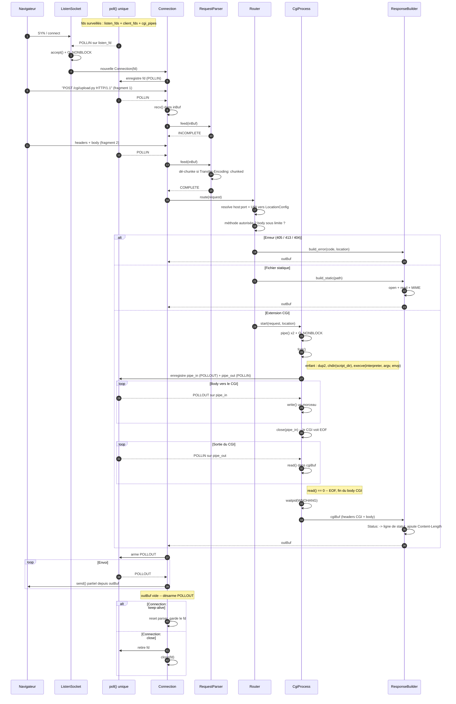
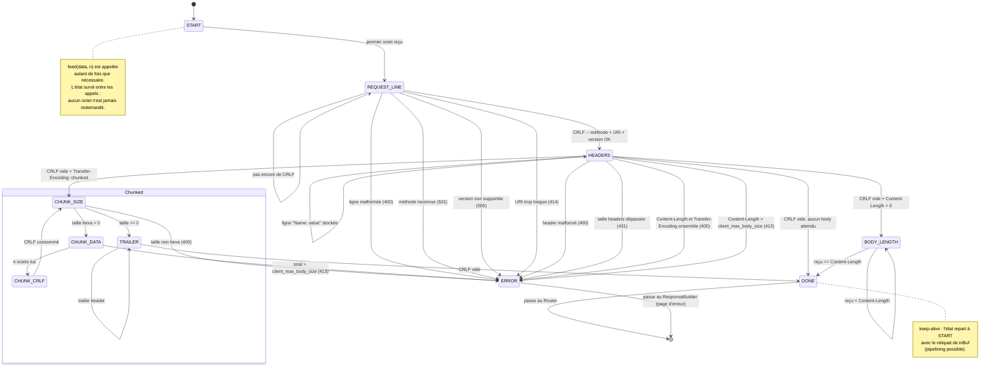

# Webserv — diagrammes pour le README

## 1. Cycle de vie d'une requête

**Ce que ce diagramme prouve à l'évaluateur** (et pourquoi il faut savoir le défendre) :
- un seul `poll()` gère listen, clients **et** pipes CGI ;
- aucun `recv`/`send`/`read`/`write` n'apparaît sans un `POLLIN`/`POLLOUT` juste au-dessus ;
- POLLOUT est armé seulement quand il y a quelque chose à écrire (sinon poll tourne à vide à 100% CPU) ;
- le parsing est incrémental : deux fragments, deux `feed()`, aucune hypothèse sur les frontières TCP.

## 2. State machine du parser HTTP

**Trois invariants à tenir dans le code :**
1. `feed()` ne bloque jamais et ne relit jamais — elle consomme ce qu'on lui donne et rend l'état.
2. Toute transition vers `ERROR` porte un code HTTP : le parser décide du statut, pas l'appelant.
3. `client_max_body_size` est vérifiée **pendant** l'accumulation, pas après. Sinon un `Content-Length: 999999999999` te fait manger la RAM avant de répondre 413.

## 3. Où les mettre

Dans le `README.md`, section « Technical choices » (le chapitre V autorise des sections en plus). GitHub les rend directement.

Attention au rendu GitHub :
- pas de `<` `>` bruts dans les labels — `&lt;` / `&gt;` ;
- pas de `:` dans un label de `stateDiagram` sans guillemets (c'est le séparateur de transition) — d'où les `--` à la place dans les libellés ci-dessus ;
- `direction TB` sur `stateDiagram-v2` demande mermaid ≥ 9.2, ce que GitHub a. Teste sur mermaid.live avant de commit.
